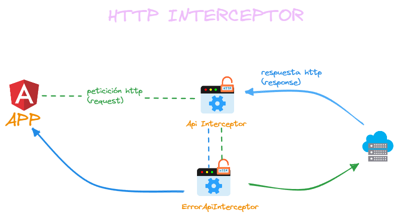

  

# Refresh Token Angular 16 + NestJS

Hola Coders!🙋‍♂️Es común usar un token en las peticiones que hacemos desde nuestra app, pero ese token puede expirar y tenemos que solicitar uno nuevo; implementemos juntos esta funcionalidad en Angular!🤗Comparte para que más personas puedan aprender🚀

  

  

## Archivo excalidraw

Si desean visualizar la grafica del flujo mostrado en el video deben ingresar a https://excalidraw.com/ e importar el archivo.

**Link del Video** 🤖

🔗 [Refresh Token en Angular 16](https://youtu.be/aolGFrOPkVk)

**Suscríbete a mi canal** 😎

🔗 [Logidev](https://www.youtube.com/c/LogiDev)

**Sígueme en mis redes:**

👉Facebook : [LogiDev25](https://facebook.com/LogiDev25)

👉Instagram: [@jimydolores](https://instagram.com/jimydolores/)

👉Twitter: [@jimydolores](https://twitter.com/jimydolores)

👉LinkedIn: [Jimy Dolores](https://linkedin.com/in/jimyhuachodolores/)
